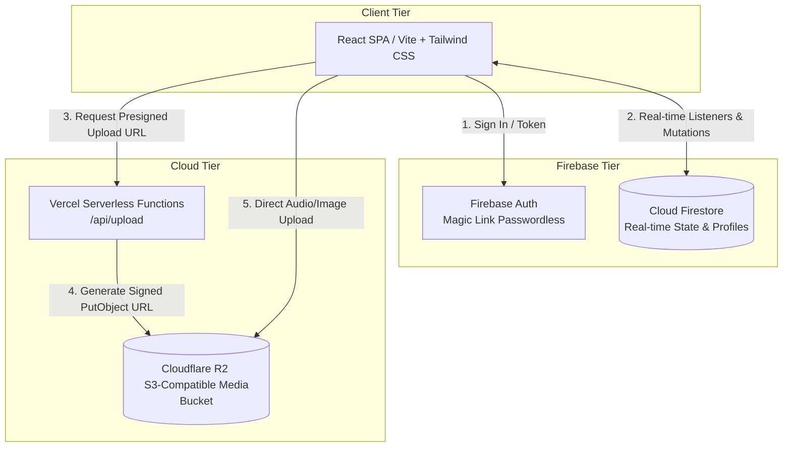

# MEW2 — Music Every Week

[](LICENSE)
[](https://react.dev/)
[](https://www.typescriptlang.org/)
[](https://vitejs.dev/)
[](https://tailwindcss.com/)
[](https://firebase.google.com/)
[](https://www.cloudflare.com/products/r2/)
[](https://vercel.com/)

**MEW2 (Music Every Week v2)** is a collaborative, cloud-native music songwriting and production platform built for creative communities. Designed to foster consistent weekly creative output, MEW2 enables hosts to launch themed **Prompts** organized into multi-week **Sessions** where songwriters, producers, and musicians submit original audio tracks, collaborate, and share feedback.

---

## ✨ Key Features

- **🎵 Structured Prompts & Sessions:** Organize creative assignments into themed seasons (e.g., *Summer 2026 Session*) with configurable submission deadlines and reveal dates.
- **🔒 Dynamic Access Modes:**
  - **Direct (Public):** Open to anyone with the link; participants are automatically accepted upon submission.
  - **Invite-Only (Private):** Host-curated rooms requiring explicit email invitation and acceptance.
  - **Volunteer Pool:** Open participant slots that members can claim on a first-come, first-served basis.
- **🎧 High-Performance Audio Player:** Continuous background audio playback, real-time waveform visualization, and timestamped threaded comments for precise production feedback.
- **🎉 Live Watch Parties:** Synchronized, real-time community listening sessions featuring live chat and host-controlled "Radio Mode" broadcasting.
- **🛠️ Creator & Admin Dashboard:** Comprehensive administrative suite to manage session calendars, moderate submissions, handle extension requests, and export stems/playlists.

---

## 🏗️ System Architecture

MEW2 is built as a modern serverless web application. Real-time state synchronization is powered by **Cloud Firestore**, while large audio and artwork files are stored securely in **Cloudflare R2** via presigned upload URLs generated by **Vercel Serverless Functions**.



### Technology Stack

| Layer | Technology | Rationale |
|---|---|---|
| **Frontend Framework** | React 19 + TypeScript + Vite | Maximum client-side performance, modern React hooks, and instant hot-module reload. |
| **Styling & UI** | Tailwind CSS v4 | Utility-first styling with responsive design tokens and dark mode support. |
| **State & Database** | Cloud Firestore | Ultra-low latency real-time listeners (`onSnapshot`) for instant community feed and chat updates. |
| **Authentication** | Firebase Auth (Magic Link) | Passwordless email authentication ensuring low friction and high security without password management overhead. |
| **File Storage** | Cloudflare R2 | Zero egress fee, S3-compatible object storage for high-bitrate WAV/MP3 audio files and cover art. |
| **Hosting & API** | Vercel | Seamless edge deployment for the SPA and Node.js serverless functions for presigned URL signing. |

---

## 🚀 Getting Started

### Prerequisites

- **Node.js:** v18.0.0 or higher
- **npm:** v9.0.0 or higher
- **Firebase Project:** With Authentication (Email Link) and Cloud Firestore enabled.
- **Cloudflare R2 Bucket:** With CORS configured for your domain(s).

### 1. Clone the Repository

```bash
git clone https://github.com/thephilgray/music-every-week.git
cd music-every-week
```

### 2. Install Dependencies

```bash
cd frontend
npm install
```

### 3. Environment Configuration

Copy the example environment file inside `frontend/` and fill in your credentials:

```bash
cp .env.example .env
```

If you plan to deploy backend Cloud Firestore security rules using the Firebase CLI, also copy the example Firebase configuration from the root directory:

```bash
cd ..
cp .firebaserc.example .firebaserc
cd frontend
```

Edit `frontend/.env`:
```env
# Firebase Configuration
VITE_FIREBASE_API_KEY=your_firebase_api_key
VITE_FIREBASE_AUTH_DOMAIN=your_project.firebaseapp.com
VITE_FIREBASE_PROJECT_ID=your_firebase_project_id
VITE_FIREBASE_MESSAGING_SENDER_ID=your_messaging_sender_id
VITE_FIREBASE_APP_ID=your_firebase_app_id

# Cloudflare R2 Storage Domain
VITE_R2_PUBLIC_DOMAIN=https://your-public-r2-domain.r2.dev

# Optional: Initial Admin Code (Remove after creating your first admin account)
VITE_ADMIN_SECRET=your_secret_admin_code

# Optional: White-Label Branding Overrides
# VITE_BRAND_NAME="Your Songwriting Club"
# VITE_BRAND_SHORT_NAME="CLUB"
# VITE_BRAND_LOGO_URL="/yourlogo.png"
# VITE_BRAND_SUPPORT_EMAIL="support@yourdomain.com"
# VITE_BRAND_TAGLINE="A collaborative music community and songwriting group."

# Server-Side Secrets (Vercel API Routes / Serverless Functions)
R2_ACCOUNT_ID=your_cloudflare_account_id
R2_ACCESS_KEY_ID=your_r2_access_key
R2_SECRET_ACCESS_KEY=your_r2_secret_key
R2_BUCKET_NAME=your_r2_bucket_name

# Optional: GitHub API Integration for automated server-side bug reporting via /api/bug-report
GITHUB_TOKEN=your_github_personal_access_token
VITE_GITHUB_REPO_URL=https://github.com/yourusername/yourrepo
```

### 4. Run Development Server

```bash
npm run dev
```

The application will be available at `http://localhost:5173`.

---

## 🚀 Production Deployment & White-Labeling

Music Every Week is designed for zero-config deployment on **Vercel** with complete white-label customization support.

### 1. Vercel Environment Variables
When deploying your clone/fork to production on Vercel, navigate to **Project Settings → Environment Variables** and add your required Firebase (`VITE_FIREBASE_*`), R2 (`R2_*`, `VITE_R2_*`), and optional GitHub credentials from your local `.env` file.

### 2. Automated Bug Reporting (GitHub API)
MEW2 includes a built-in serverless function (`/api/bug-report`) that allows users to file bug reports directly as GitHub issues without needing a GitHub account.
To enable automatic server-side issue filing in your deployment:
1. Generate a GitHub Personal Access Token (PAT) with `issues:write` access to your target repository.
2. Add the following to your Vercel Environment Variables:
   - `GITHUB_TOKEN`: Your GitHub PAT.
   - `VITE_GITHUB_REPO_URL`: Your repository URL (e.g., `https://github.com/yourusername/yourrepo`).
*Note: If `GITHUB_TOKEN` is not configured, the frontend gracefully degrades to opening a pre-filled GitHub issue in the user's browser using `VITE_GITHUB_REPO_URL`.*

### 3. Customizing Your Brand (No Git Changes Required!)
To customize the application name, logo, or support email for your own songwriting community without altering open-source code in Git, set any of the following optional override variables in your Vercel Environment Variables:

| Variable Name | Description | Example Value |
| :--- | :--- | :--- |
| `VITE_BRAND_NAME` | Full name of your platform | `"Songwriters League"` |
| `VITE_BRAND_SHORT_NAME` | 3–4 letter acronym or short name | `"LEAGUE"` |
| `VITE_BRAND_LOGO_URL` | URL or public asset path for logo | `"/customlogo.png"` |
| `VITE_BRAND_SUPPORT_EMAIL` | Email displayed on help/privacy links | `"support@songwritersleague.com"` |
| `VITE_BRAND_TAGLINE` | Homepage hero description | `"A weekly collaborative music community."` |

### 3. Pro-Tip: Pushing Local Env Vars via CLI
If you prefer command-line workflows, you can use the Vercel CLI to pipe variables directly from your local terminal to Vercel:
```bash
printf "support@yourdomain.com" | npx vercel env add VITE_BRAND_SUPPORT_EMAIL production
```

---

## 🤖 AI Agents & Developer Context

This project is optimized for automated AI coding assistants (such as Claude, Cursor, and Gemini). If you are working on codebase contributions or using AI agents, please consult our specialized developer documentation:

- **[CLAUDE.md](CLAUDE.md):** Quick-start reference, architectural invariants, and command cheat sheet for AI assistants.
- **[.agents/AGENTS.md](.agents/AGENTS.md):** Comprehensive project context, domain terminology mappings, and data schema rules.

---

## 📂 Project Structure

```text
├── docs/
│   └── proposals/       # Active feature specifications and roadmap proposals
├── frontend/
│   ├── api/             # Vercel serverless endpoints (e.g., R2 upload URL signing)
│   ├── public/          # Static assets and manifest
│   └── src/
│       ├── components/  # Reusable UI components and modal dialogs
│       ├── config/      # Application and brand theme configuration
│       ├── contexts/    # React contexts (Auth, Player, Toast)
│       ├── hooks/       # Custom React hooks (real-time sync, audio analysis)
│       ├── lib/         # Core integrations (Firebase, R2 uploaders, audio workers)
│       ├── pages/       # Main application route views
│       └── types.ts     # Global TypeScript interfaces and data model definitions
├── firestore.rules      # Security rules for Cloud Firestore
└── vercel.json          # Deployment configuration for Vercel
```

---

## 🤝 Contributing

We welcome contributions from the songwriting and developer community!
1. Fork the repository
2. Create a feature branch (`git checkout -b feature/amazing-feature`)
3. Commit your changes (`git commit -m 'Add amazing feature'`)
4. Push to the branch (`git push origin feature/amazing-feature`)
5. Open a Pull Request

---

## 📄 License

This project is licensed under the MIT License — see the [LICENSE](LICENSE) file for details.
